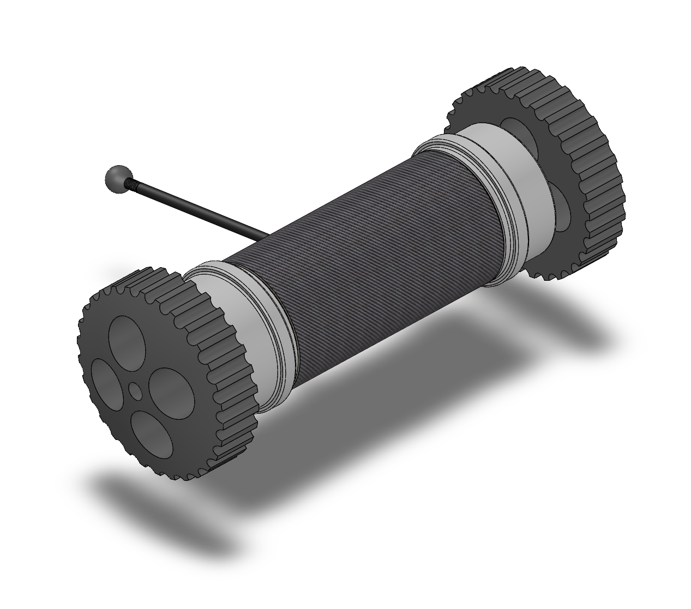
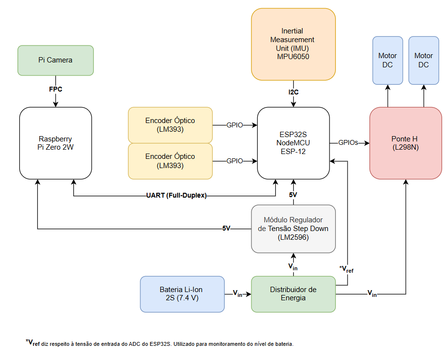
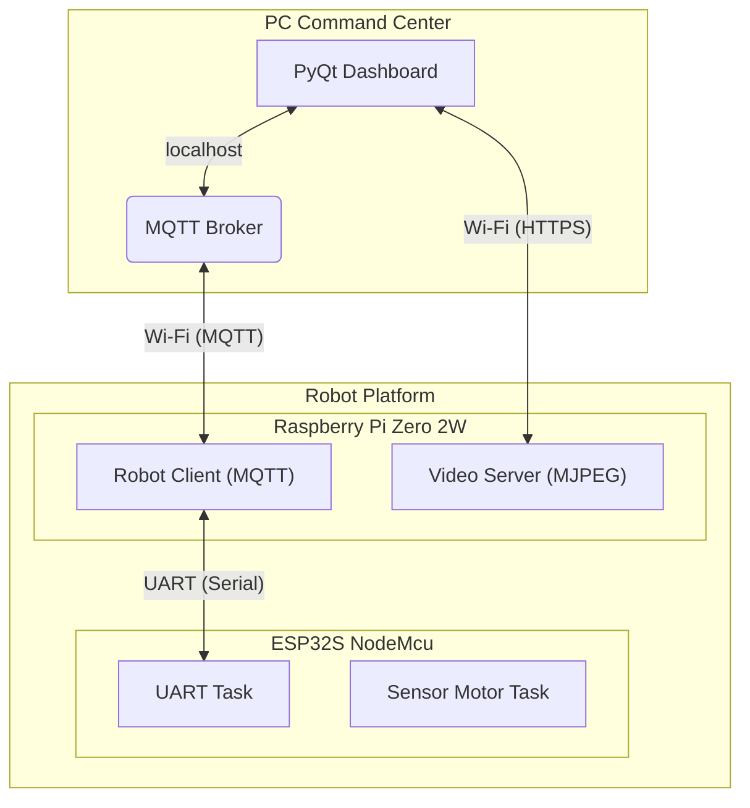

# 🤖 Tatu-Bomba


[](https://www.freertos.org/)


## Integrantes do Grupo 

| Nome | R.A. |
| ---- | ---- |
| André Solano F. R. Maiolini | 19.02012-0 |
| Durval Consorti Soranz de Barros Santos | 22.01097-0 |
| Leonardo Roberto Amadio | 22.01300-8 |

## Apresentação do Projeto

Este repositório contém todo o software embarcado para o projeto **Tatu-Bomba**, um **Robô de Reconhecimento Tático** (inspirado no *TTR - Throwable Tactical Robot* da *Recon Robotics*). O objetivo é desenvolver uma plataforma de vigilância móvel capaz de ser controlada remotamente, transmitindo vídeo em tempo real.



## 🏗️ Arquitetura do Sistema

A arquitetura de software é distribuída em dois processadores principais que trabalham em conjunto para alcançar um desacoplamento entre o controle de alto e baixo nível.

- **Raspberry Pi Zero 2 W (Cérebro)**: Atua como o computador principal de bordo. É responsável pelas tarefas de alta complexidade, como processamento de vídeo, comunicação em rede (Wi-Fi), e a execução da lógica principal do robô.
- **ESP32 (Controlador de Tempo Real)**: Funciona como um microcontrolador auxiliar dedicado. Ele lida com todas as tarefas de tempo real que exigem precisão e baixa latência, como o controle dos motores e a leitura de sensores de alta frequência (encoders e IMU).
- **PC / Dashboard (Estação de Controle)**: Uma interface de operador que se comunica com o robô via Wi-Fi através do protocolo MQTT para enviar comandos e receber o stream de vídeo e a telemetria.

A seguir, tem-se o diagrama de blocos dos componentes eletrônicos utilizados para a construção da plataforma do robô:



O diagrama abaixo ilustra a interação entre os componentes arquiteturais principais do sistema:



## 📦 Componentes de Software

Este repositório está organizado nos seguintes diretórios principais:
```plain
Software/
|
├── esp32_firmware/            # Código do firmware utilizando PlatformIO
│   ├── .pio
│   ├── platformio.ini
|   ├── ...
│   └── README.md              # Explicação da arquitetura e funcionamento
│
├── pc_command_center/         # Código para rodar no computador (acesso)
│   ├── dashboard/             # Dashboard para controle do robô
│   ├── venv/                  # Ambiente virtual Python
|   ├── ...
│   └── README.md              # Explicação para utilização
|
├── rpi_software/              # Código do software rodando na RPi
│   ├── robot_client/          # Ponte de comunicação 
│   ├── video_server/          # Servidor de streaming de vídeo
|   ├── services/              # Configurações serviços 'systemd'
|   ├── config.py              # Configurações gerais dos serviços
|   ├── ...
│   └── README.md              # Explicação da arquitetura e funcionamento
|
├── ...
├── README.md                  # Explicação geral do projeto
└── .gitignore
```

### 🧠 Software da Raspberry Pi

O cérebro do robô, escrito em Python. Suas responsabilidades incluem:

- *Ponte de Comunicação*: Traduz mensagens MQTT do dashboard em comandos seriais para o ESP32 e, inversamente, converte os dados de telemetria do ESP32 em publicações MQTT.
- *Streaming de Vídeo*: Executa um servidor web que captura o feed da câmera e o transmite em formato MJPEG para o dashboard.
- *Gerenciamento de Estado*: Mantém o estado de conexão do robô utilizando o mecanismo Last Will do MQTT.

[➡️ Clique aqui para acessar o README completo do software da RPi](./rpi_software/README.md)

### ⚙️ Firmware do ESP32

O controlador de tempo real do robô, escrito em C++/Arduino com FreeRTOS. Suas responsabilidades incluem:

- *Controle Preciso dos Motores*: Gera sinais PWM para a ponte H a partir dos comandos recebidos.
- *Leitura de Sensores*: Lê os encoders de roda e a IMU em uma frequência constante e elevada.
- *Envio de Telemetria*: Agrupa todos os dados dos sensores em um pacote binário e o envia via UART para a Raspberry Pi.

[➡️ Clique aqui para acessar o README completo do firmware do ESP32](./esp32_firmware/README.md)

### 🎮 Dashboard de Comando no PC

O dashboard roda na máquina do usuário - com uma interface intuitiva, desenvolvida usando PyQt - permitindo a leitura da telemetria e controle de movimentação (além da visualização do vídeo).

[➡️ Clique aqui para acessar o README completo do dashboard](./pc_command_center/README.md)

## ✨ Funcionalidades Principais
- ✅ Controle Remoto via Wi-Fi: Movimentação confiável através de uma interface de controle.
- ✅ Streaming de Vídeo em Tempo Real: Transmissão de vídeo de baixa latência da câmera do robô para o operador.
- ✅ Telemetria Completa: Envio de dados vitais como tensão da bateria e dados de odometria (encoders e IMU) para o dashboard.
- ⏳ Modo Sentinela (Futuro): Utilizar IA para detectar e rastrear alvos de forma autônoma.
- ⏳ Patrulha por Waypoints (Futuro): Executar rotas pré-definidas de forma autônoma com base na odometria.

## Requisitos do Sistema

### 🧩 Tabela de Requisitos Funcionais
Os requisitos funcionais descrevem **o que o sistema deve fazer**.

| ID    | Requisito                                                                                                   | Prioridade   | Critério de Aceitação                                                                                                   |
|--------|-------------------------------------------------------------------------------------------------------------|---------------|--------------------------------------------------------------------------------------------------------------------------|
| **RF01** | O sistema deve permitir o controle de movimento do robô (frente, trás, rotação) através da interface no dashboard. | **Obrigatório** | O robô responde aos comandos de movimento do joystick virtual com um atraso perceptível inferior a 500 ms.               |
| **RF02** | O sistema deve transmitir vídeo em tempo real da câmera do robô para o dashboard do operador.              | **Obrigatório** | O feed de vídeo é exibido no dashboard, cumprindo os critérios de performance definidos em RNF01.                        |
| **RF03** | O robô deve ser ativado e desativado fisicamente através de um pino removível.                             | **Opcional**   | Com o pino removido, os motores não respondem a nenhum comando. Ao reinserir o pino, a operação é restaurada.            |
| **RF04** | O robô deve enviar dados de telemetria (nível da bateria em volts e status da conexão) para o dashboard.   | **Obrigatório** | Os valores de tensão elétrica e o status “online/offline” são exibidos corretamente no dashboard. |
| **RF05** | O sistema deve detectar a presença de ameaças no campo de visão da câmera usando um modelo de visão computacional. | **Opcional**   | O sistema desenha uma caixa delimitadora (bounding box) em torno da ameaça detectada no feed de vídeo em tempo real.     |
| **RF06** | O robô deve ser capaz de executar uma sequência de movimentos pré-definida (modo patrulha).               | **Opcional**   | O robô executa com sucesso uma sequência (ex: “frente 1 m, girar 90°, frente 1 m”) carregada de um arquivo de configuração. |

### ⚙️ Tabela de Requisitos Não Funcionais
Os requisitos não funcionais descrevem **como o sistema deve operar**, definindo suas qualidades.

| ID    | Requisito                                                                                                   | Prioridade   |
|--------|-------------------------------------------------------------------------------------------------------------|---------------|
| **RNF01** | O streaming de vídeo deve ter uma taxa de atualização de no mínimo **30 FPS** e uma latência ponta-a-ponta **inferior a 500 ms**. | **Obrigatório** |
| **RNF02** | A bateria deve fornecer uma autonomia de operação de no mínimo **30 minutos** em condições de uso moderado. | **Obrigatório** |
| **RNF03** | A comunicação Wi-Fi deve ser estável em um raio de no mínimo **20 metros** em ambiente interno. | **Obrigatório** |
| **RNF04** | A interface de controle deve permitir que um novo operador execute tarefas básicas rapidamente. | **Obrigatório** |
| **RNF05** | O software deve ser modular, com baixo acoplamento entre os componentes de comunicação, controle e interface. | **Obrigatório** |
| **RNF06** | O sistema deve ser **tolerante a falhas** de comunicação, descartando mensagens corrompidas ou malformadas sem travar. | **Obrigatório** |
| **RNF07** | O robô deve entrar em **modo de segurança** (parar os motores) se a comunicação com o operador for perdida por um tempo pré-determinado. | **Obrigatório** |
| **RNF08** | O peso total do robô montado, incluindo a bateria, deve ser **inferior a 1 kg**. | **Opcional** |

