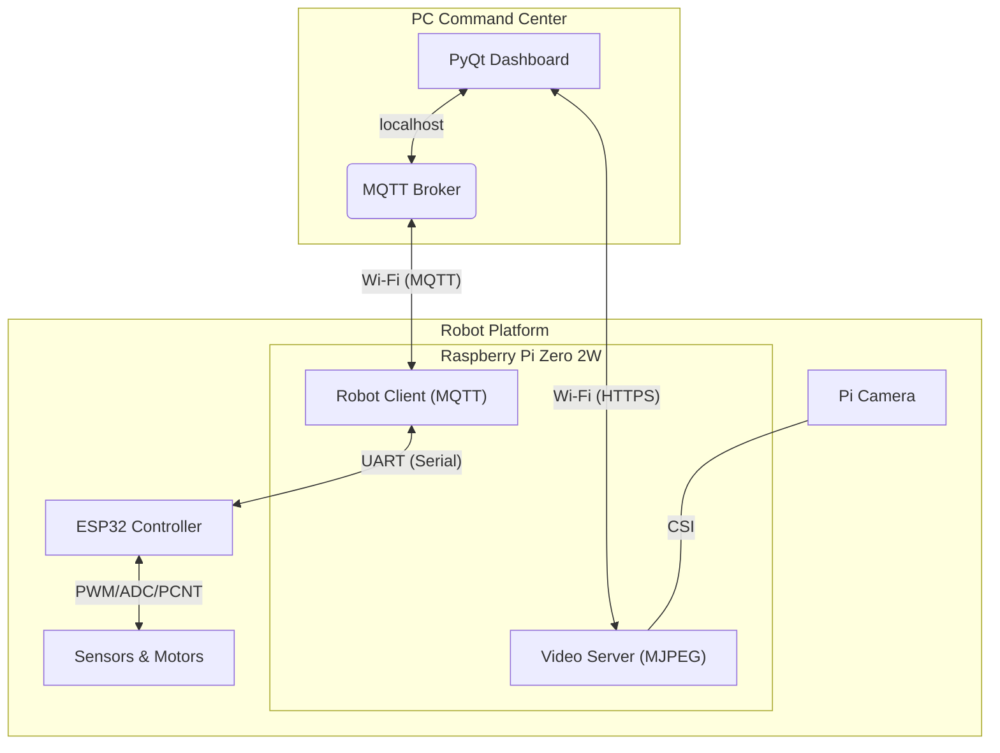

# 🤖 Tatu-Bomba

## 📄 Resumo do Projeto

Este repositório contém todo o software embarcado para o projeto **Tatu-Bomba**, um **Robô de Reconhecimento Tático** (*TTR - Throwable Tactical Robot*). O objetivo é desenvolver uma plataforma de vigilância móvel capaz de ser controlada remotamente, transmitindo vídeo em tempo real e, futuramente, executando tarefas autônomas com inteligência artificial.

## 🏗️ Arquitetura do Sistema

A arquitetura de software é distribuída em dois processadores principais que trabalham em conjunto para alcançar um desacoplamento entre o controle de alto e baixo nível.

- **Raspberry Pi Zero 2 W (Cérebro)**: Atua como o computador principal de bordo. É responsável pelas tarefas de alta complexidade, como processamento de vídeo, comunicação em rede (Wi-Fi), e a execução da lógica principal do robô.
- **ESP32 (Controlador de Tempo Real)**: Funciona como um microcontrolador auxiliar dedicado. Ele lida com todas as tarefas de tempo real que exigem precisão e baixa latência, como o controle dos motores e a leitura de sensores de alta frequência (encoders e IMU).
- **PC / Dashboard (Estação de Controle)**: Uma interface de operador que se comunica com o robô via Wi-Fi através do protocolo MQTT para enviar comandos e receber o stream de vídeo e a telemetria.

A seguir, tem-se o diagrama de blocos dos componentes eletrônicos utilizados para a construção da plataforma do robô:


O diagrama abaixo ilustra a interação entre os componentes arquiteturais principais do sistema:



## 📦 Componentes de Software

Este repositório está organizado nos seguintes diretórios principais:
```plain
Software/
|
├── esp32_firmware/            # Código do firmware utilizando PlatformIO
│   ├── .pio
│   ├── platformio.ini
|   ├── ...
│   └── README.md              # Explicação da arquitetura e funcionamento
│
├── pc_command_center/         # Código para rodar no computador (acesso)
│   ├── dashboard/             # Dashboard para controle do robô
│   ├── venv/                  # Ambiente virtual Python
|   ├── ...
│   └── README.md              # Explicação para utilização
|
├── rpi_software/              # Código do software rodando na RPi
│   ├── robot_client/          # Ponte de comunicação 
│   ├── video_server/          # Servidor de streaming de vídeo
|   ├── services/              # Configurações serviços 'systemd'
|   ├── config.py              # Configurações gerais dos serviços
|   ├── ...
│   └── README.md              # Explicação da arquitetura e funcionamento
|
├── ...
├── README.md                  # Explicação geral do projeto
└── .gitignore
```

### 🧠 Software da Raspberry Pi

O cérebro do robô, escrito em Python. Suas responsabilidades incluem:

- *Ponte de Comunicação*: Traduz mensagens MQTT do dashboard em comandos seriais para o ESP32 e, inversamente, converte os dados de telemetria do ESP32 em publicações MQTT.
- *Streaming de Vídeo*: Executa um servidor web que captura o feed da câmera e o transmite em formato MJPEG para o dashboard.
- *Gerenciamento de Estado*: Mantém o estado de conexão do robô utilizando o mecanismo Last Will do MQTT.

[➡️ Clique aqui para acessar o README completo do software da RPi](./rpi_software/README.md)

### ⚙️ Firmware do ESP32

O controlador de tempo real do robô, escrito em C++/Arduino com FreeRTOS. Suas responsabilidades incluem:

- *Controle Preciso dos Motores*: Gera sinais PWM para a ponte H a partir dos comandos recebidos.
- *Leitura de Sensores*: Lê os encoders de roda e a IMU em uma frequência constante e elevada.
- *Envio de Telemetria*: Agrupa todos os dados dos sensores em um pacote binário e o envia via UART para a Raspberry Pi.

[➡️ Clique aqui para acessar o README completo do firmware do ESP32](./esp32_firmware/README.md)

## ✨ Funcionalidades Principais
- ✅ Controle Remoto via Wi-Fi: Movimentação confiável através de uma interface de controle.
- ✅ Streaming de Vídeo em Tempo Real: Transmissão de vídeo de baixa latência da câmera do robô para o operador.
- ✅ Telemetria Completa: Envio de dados vitais como tensão da bateria e dados de odometria (encoders e IMU) para o dashboard.
- ⏳ Modo Sentinela (Futuro): Utilizar IA para detectar e rastrear alvos de forma autônoma.
- ⏳ Patrulha por Waypoints (Futuro): Executar rotas pré-definidas de forma autônoma com base na odometria.

