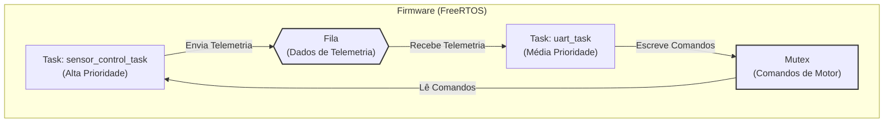
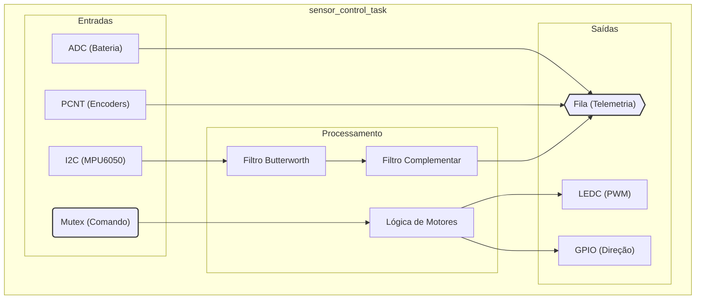
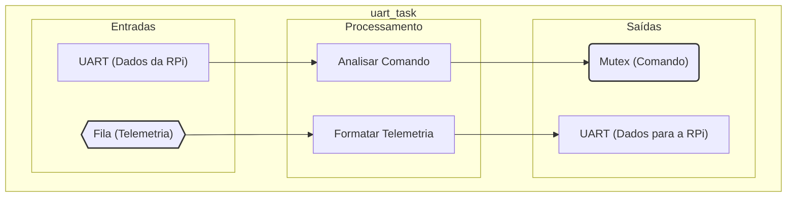

# 🤖 Firmware do ESP32

Este diretório contém o código-fonte do firmware que roda no microcontrolador ESP32, atuando como o controlador de baixo nível e tempo real do robô Tatu-Bomba. Ele é responsável pela interface direta com os sensores e atuadores, garantindo respostas rápidas e precisas.

## 🎯 Responsabilidades Principais

- Controle de Motores: Gera os sinais PWM para os drivers de motor, controlando a velocidade e a direção das rodas.
- Aquisição de Dados dos Sensores: Realiza a leitura de alta frequência dos sensores críticos:
    - Encoders de Roda: Utiliza o hardware de contador de pulsos (PCNT) do ESP32 para odometria.
    - Unidade de Medição Inercial (IMU MPU6050): Coleta dados de acelerômetro e giroscópio.
    - Monitor de Bateria: Lê a tensão da bateria através de um pino ADC.
- Comunicação com a Raspberry Pi: Mantém uma comunicação serial (UART) full-duplex com o software de alto nível, recebendo comandos e enviando pacotes de telemetria.

## 🏗️ Arquitetura do Software (FreeRTOS)

O firmware é construído sobre o FreeRTOS para garantir a execução concorrente e determinística das tarefas de tempo real. A arquitetura é dividida em duas tarefas principais que se comunicam de forma segura através de filas e mutexes.

- `sensor_motor_task`:
    - Executa em um loop de alta frequência (ex: 100Hz).
    - Lê todos os sensores (MPU6050, Encoders, ADC da Bateria).
    - Aplica filtros simples (como média móvel) nos dados brutos.
    - Envia a struct de telemetria consolidada para uma fila (telemetryQueue).
    - Lê o estado de comando atual (protegido por um commandMutex) e atua diretamente nos motores.

- `communication_task`:
    - Aguarda por novos dados na porta serial (UART) vindos da Raspberry Pi.
    - Analisa (parse) as strings de comando recebidas (ex: DRIVE:80,-75\n).
    - Atualiza as variáveis globais de comando de forma segura, utilizando o commandMutex.
    - Verifica a telemetryQueue e, se houver novos dados, os envia para a Raspberry Pi como um pacote binário.

## 🔌 Protocolo de Comunicação (UART)

A comunicação entre o ESP32 e a Raspberry Pi utiliza um protocolo serial customizado.

### Comandos (RPi → ESP32)

Mensagens de texto ASCII terminadas com `\n`.

- Movimento: `DRIVE:<left_speed>,<right_speed>\n`
    - `left_speed` e `right_speed` são inteiros de -100 a 100.
    - Exemplo: `DRIVE:50,-50\n` (girar no próprio eixo)

### Telemetria (ESP32 → RPi)

Pacote de dados binário (struct) enviado continuamente.

| Campo          | Tipo        | Tamanho      | Descrição                                      |
|----------------|-------------|--------------|------------------------------------------------|
| `start_byte`   | `uint8_t`   | 1 byte       | Byte de sincronização (valor fixo `0xAA`)      |
| `timestamp_us` | `int64_t`   | 8 bytes      | Timestamp em microssegundos (us)               |
| `pitch`        | `float`     | 4 bytes      | Ângulo de inclinação Pitch                     |
| `roll`         | `float`     | 4 bytes      | Ângulo de inclinação Roll                      |
| `gyro_z_raw`   | `int16_t`   | 2 bytes      | Velocidade angular Z                           |
| `left_encoder` | `int32_t`   | 4 bytes      | Contagem do encoder esquerdo                   |
| `right_encoder`| `int32_t`   | 4 bytes      | Contagem do encoder direito                    |
| `battery_mv`   | `uint16_t`  | 2 bytes      | Tensão da bateria em milivolts (mV)            |
| `checksum`     | `uint8_t`   | 1 byte       | Checksum (XOR de todos os bytes)               |
| **Total**      | —           | **30 bytes** | —                                              |

## ⚡Mapeamento de Pinos (Pinout)

O mapeamento de pinos está definido no arquivo `main.cpp`.

| Componente     | Pino ESP32  | Descrição                              |
|----------------|-------------|----------------------------------------|
| **Motor A**    | GPIO 13     | EN A (PWM)                             |
|                | GPIO 12     | IN 1                                   |
|                | GPIO 14     | IN 2                                   |
| **Motor B**    | GPIO 25     | EN B (PWM)                             |
|                | GPIO 27     | IN 3                                   |
|                | GPIO 26     | IN 4                                   |
| **Encoder A**  | GPIO 34     | Sinal do Encoder do Motor A            |
| **Encoder B**  | GPIO 35     | Sinal do Encoder do Motor B            |
| **IMU (I2C)**  | GPIO 21     | SDA                                    |
|                | GPIO 22     | SCL                                    |
| **Bateria**    | GPIO 32     | Leitura ADC (via divisor de tensão)    |
| **UART (RPi)** | GPIO 16     | RX (Recebe do TX do RPi)               |
|                | GPIO 17     | TX (Envia para o RX do RPi)            |

 
